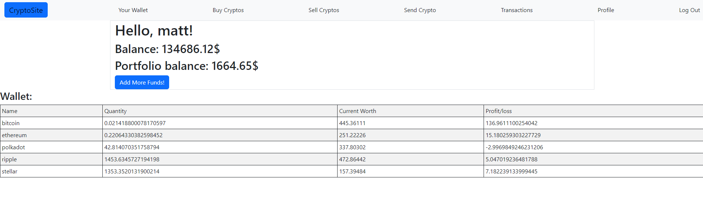

# CryptoSite
It's website that can be used as investing simulator for crypto currencies.

## How to run
Clone the project using the command "git clone https://github.com/matthias152/CryptoSite"
The dependencies are mentioned in Pipfile. It is recommended to run the app inside a virtual environment to avoid conflict of existing dependencies.
```
- Run the command "pip install pipenv"
- Run "pipenv shell". Creates virtual env
- Run "pipenv install". Installs dependencies from the PipFile and creates PipFile.lock
- Run "python manage.py runserver" to start the server
```
Superuser:
```
Login: matt
Password: 1526
```

## Description
It's using CoinGecko's API for checking the current exchange of cryptos.
Website contains buying, selling, sending cryptos to other users, tracking the current profit/loss and history of transactions.  
There is also API created with django-restframework.


